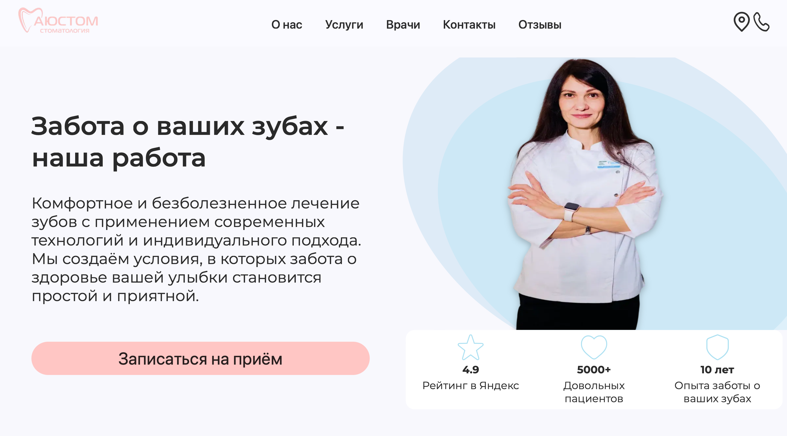
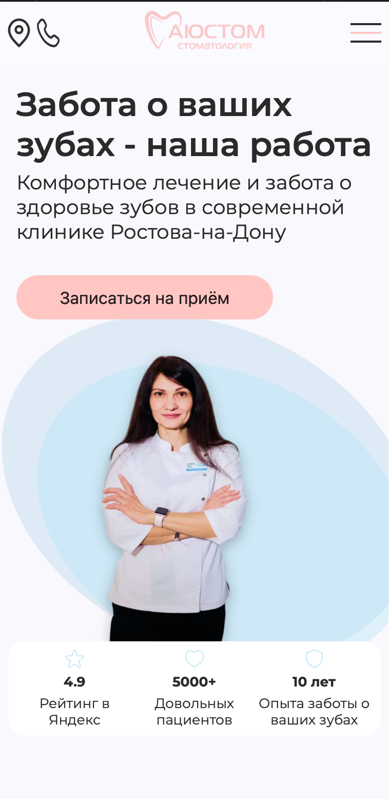

# 🦷 austom.ru — Сайт стоматологической клиники «Аюстом»

Веб-приложение для стоматологической клиники. SPA-одностраничник с онлайн-записью на приём, каталогом услуг с прайс-листом, слайдерами портфолио, интеграцией с CRM через чат-бот и полностью адаптивной резиновой вёрсткой.

🌐 **Сайт:** [austom.ru](https://austom.ru)

---

## 📸 Превью

<!-- Вставь сюда скриншоты: положи файлы в public/assets/ -->
| Десктоп | Мобильная версия |
|:---:|:---:|
|  |  |

---

## 📋  Структура и функционал

### 1. О нас
Вводный блок с позиционированием клиники и CTA-кнопкой «Записаться на приём», которая открывает модальное окно с формой записи.

### 2. Форма записи на приём
Модальное окно с валидацией каждого поля на клиенте:
- **ФИО** — проверка на заполненность.
- **Телефон** — маска `+7 (___) ___-__-__`, контроль длины, проверка корректности ввода.
- **Комментарий** — опциональное текстовое поле.
- **Согласие на обработку ПДн** — чекбокс, блокирующий отправку до подтверждения.


После отправки данные уходят через `route.js` в чат-бот **Max**, который формирует структурированное уведомление и отправляет его администратору клиники в мессенджер.

### 3. Услуги
Карточки услуг с названием, описанием и кнопкой «Подробнее». По клику раскрывается вкладка с детальным прайсом.

### 4. Портфолио (До / После)
Слайдер с фотографиями работ «до» и «после» (расположены друг под другом для наглядного сравнения). Управление: свайп на тач-устройствах + стрелки `< >` на десктопе.

### 5. Галерея клиники
Слайдер с фотографиями интерьера и оборудования клиники.

### 6. Врачи
Слайдер с карточками специалистов: ФИО, специализация.

> В планах — вынос блока на отдельную страницу с расширенными профилями.

### 7. Акции
Карточки действующих спецпредложений (скидка 10% участникам СВО, скидка на гигиену до 01.01.2027). Каждая карточка содержит кнопку «Записаться на приём», ведущую к форме.

### 8. Отзывы
Встроенный виджет отзывов из Яндекс.

### 9. Футер
- Интерактивная **Яндекс.Карта** с меткой расположения клиники.
- Режим работы.
- Контакты: телефон, электронная почта.

---

## 🛠 Стек

- **Frontend:** NextJs, JavaScript (ES6+)
- **Сборщик:**  Turbopack
- **Стилизация:** CSS3, SCSS, адаптивная (резиновая) вёрстка
- **Слайдеры:** кастомная реализация (touch-events + кнопки)
- **Интеграции:** Чат-бот Max (отправка заявок через route.js), виджет Яндекс.Отзывы, Яндекс.Карты API
- **Деплой:** TimeWebCloud

---

## 💡 Технические особенности

**Резиновая вёрстка.** Плавная адаптация под любую ширину экрана от 320px до широких мониторов. Без жёстких брейкпоинтов — все блоки перестраиваются пропорционально.

**Оптимизация медиа.** Все фотографии (портфолио, галерея, врачи) сжаты и оптимизированы для быстрой загрузки без видимой потери качества.

**Интеграция с Max.** Заявка не просто уходит в базу — чат-бот в мессенджере Max получает структурированное сообщение с данными пациента, что позволяет администратору клиники мгновенно обработать запись.

**Слайдеры.** Реализованы без тяжёлых библиотек. Поддержка touch-событий для мобильных и кнопочной навигации для десктопа.

---

## 👥 Команда

**Frontend-разработка** Рустам
Вёрстка, адаптив, логика приложения, деплой
- Telegram: [ссылка]
- Почта: [email]
    
**UI/UX дизайн:** Альбина
Визуальная концепция, разработка даизайн макетов и прототипов, типографика, стилизация
- Telegram: [ссылка]
- Max: [ссылка]
- Почта: [email]
- Figma-макет: [ссылка]

---

## 🚀 Запуск проекта

**1. Клонировать репозиторий:**
```
git clone https://github.com/Rusta-16/austom-stomatology-app.git
```
2. Перейти в директорию проекта:
```
cd austom-stomatology-app
```
3. Установить зависимости:
```
npm install
```
4. Запустить dev-сервер:
```
npm run dev
```
Локальная версия будет доступна по адресу, указанному в терминале (по умолчанию http://localhost:3000).
